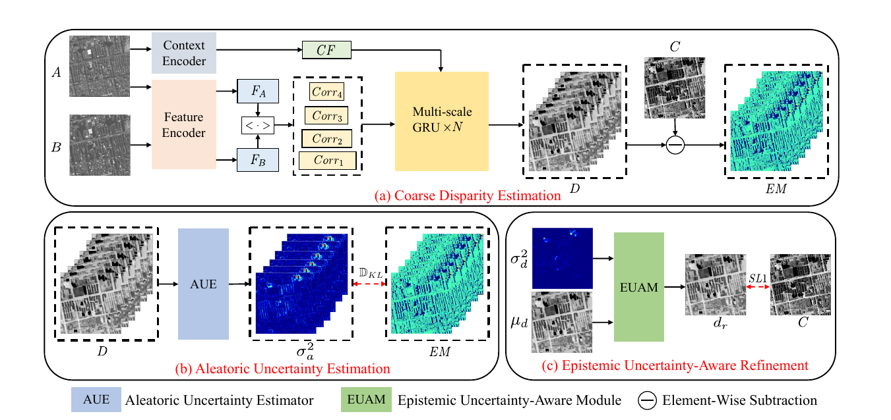
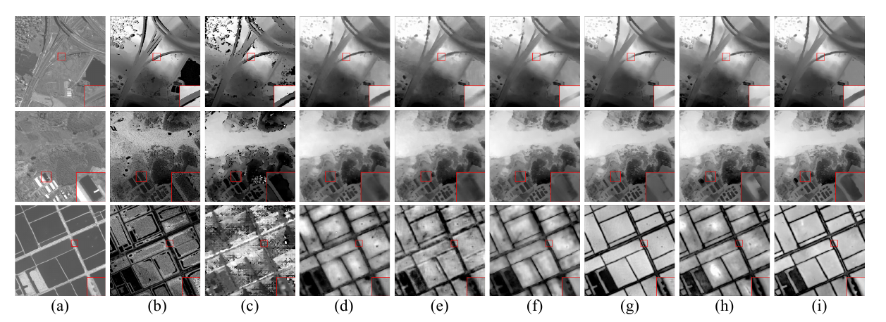
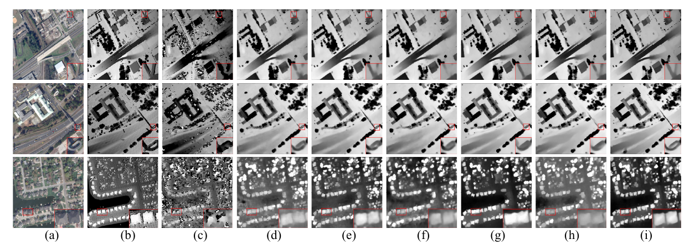

# UA-SISM
This is the official code for UA-SISM.

# Requirements

```python==3.8```

```einops==0.3.0```

# Framework



# Visualization on WHU-Stereo dataset


(a) left image. (b) disparity ground truth. (c) SGM. (d) PSMNet. (e) GwcNet. (f) HMSMNet. (g) DLNR. (h) PCV. (i) Ours.

# Visualization on US3D dataset


(a) left image. (b) disparity ground truth. (c) SGM. (d) PSMNet. (e) GwcNet. (f) HMSMNet. (g) DLNR. (h) PCV. (i) Ours.


# Dataset Preparation
* [WHU-Stereo](https://github.com/Sheng029/WHU-Stereo)
* [US3D](https://ieee-dataport.org/open-access/data-fusion-contest-2019-dfc2019)
  
  Note：If you want to use our preprocessed US3D dataset, please download：

# Comparsion with other methods
The best score for each metric is marked in **bold**.
|Method       |  EPE(Px)  |  D1(%) |
|-------------|-----------|--------|
|SGM          |  4.989    |  36.22 |
|PSMNet       |  2.183    |  21.95 |
|GwcNet       |  2.265    |  22.80 |
|HMSMNet      |  2.040    |  19.00 |
|DLNR         |  1.864    |  16.56 |
|PCV          |  1.918    |  17.31 |
|Ours         |**1.739**  |**14.71**|

# Comparsion with other methods
The best score for each metric is marked in **bold**.
|Method       |  EPE(Px)  |  D1(%) |
|-------------|-----------|--------|
|SGM          |  2.398    |  19.93 |
|PSMNet       |  1.499    |  9.22 |
|HMSMNet      |  1.473    |  9.17 |
|RAFT         |  1.366    |  7.72 |
|DLNR         |  1.389    |  8.03 |
|Ours         |**1.313**  |**7.17**|

# Train
Once we have organized the code, we will release it.
