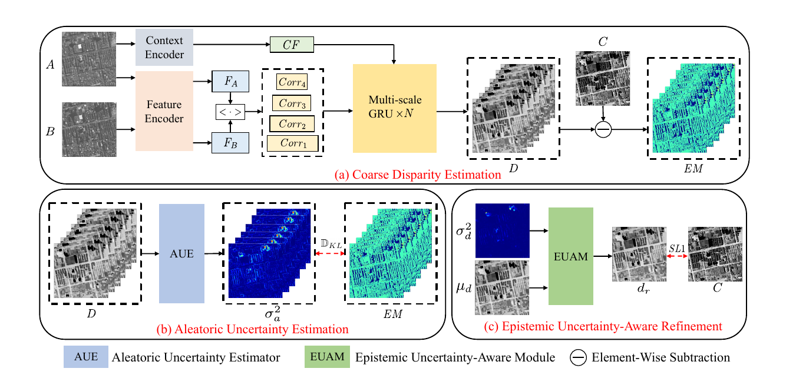
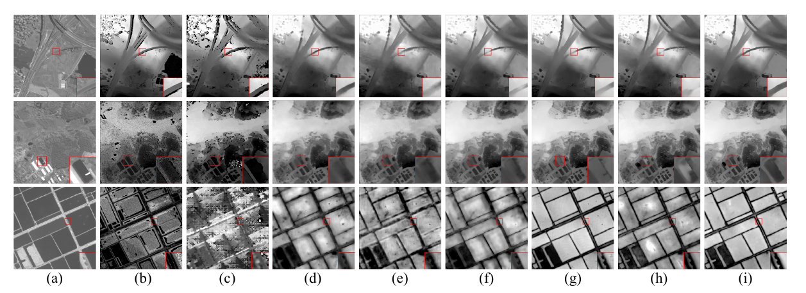
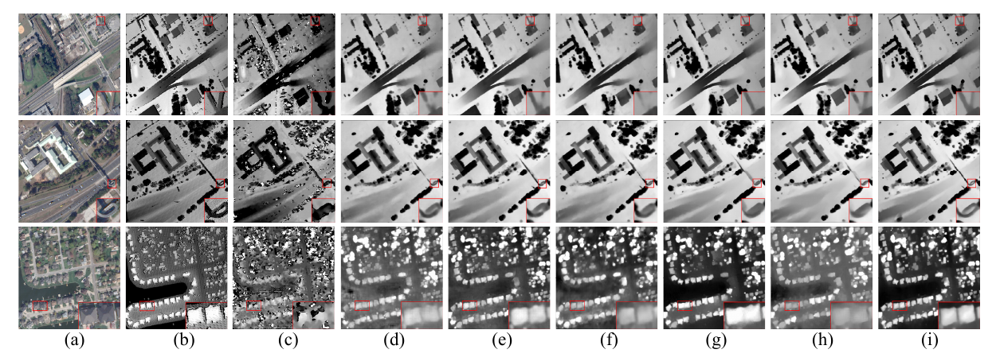

# UA-SISM
This is the official code for UA-SISM (https://ieeexplore.ieee.org/document/11494089).

# Installation

```pip install -r requirements.txt```

# Pretrained weights

Please download and extract the pretrained weights, rename “UA_SISM_weights” to “weights”, and place it in the project root directory.

https://pan.baidu.com/s/1iTNl_v50vvgoZ837hLbl0Q?pwd=6tjb

# Framework



# Visualization on WHU-Stereo dataset


(a) left image. (b) disparity ground truth. (c) SGM. (d) PSMNet. (e) GwcNet. (f) HMSMNet. (g) DLNR. (h) PCV. (i) Ours.

# Visualization on US3D dataset


(a) left image. (b) disparity ground truth. (c) SGM. (d) PSMNet. (e) GwcNet. (f) HMSMNet. (g) DLNR. (h) PCV. (i) Ours.


# Dataset Preparation
* [WHU-Stereo](https://github.com/Sheng029/WHU-Stereo)
* [US3D](https://ieee-dataport.org/open-access/data-fusion-contest-2019-dfc2019)
  
  Note：If you want to use our preprocessed US3D dataset, please download：

# Comparsion WHU-Stereo dataset
The best score for each metric is marked in **bold**.
|Method       |  EPE(Px)  |  D1(%) |
|-------------|-----------|--------|
|SGM          |  4.989    |  36.22 |
|PSMNet       |  2.183    |  21.95 |
|GwcNet       |  2.265    |  22.80 |
|HMSMNet      |  2.040    |  19.00 |
|DLNR         |  1.864    |  16.56 |
|PCV          |  1.918    |  17.31 |
|Ours         |**1.739**  |**14.71**|

# Comparsion on US3D dataset
The best score for each metric is marked in **bold**.
|Method       |  EPE(Px)  |  D1(%) |
|-------------|-----------|--------|
|SGM          |  2.398    |  19.93 |
|PSMNet       |  1.499    |  9.22 |
|GwcNet       |  1.406    |  8.08 |
|HMSMNet      |  1.473    |  9.17 |
|DLNR         |  1.389    |  8.03 |
|PCV         |  1.488    |  9.46 |
|Ours         |**1.352**  |**7.67**|

## Test
```
python evaluate_stereo.py \
    --mode 16bit \
    --device cuda \
    --test_left_dir dataset/WHU-Stereo/with_GT/test_all/left \
    --test_right_dir dataset/WHU-Stereo/test_all/right \
    --test_disp_dir dataset/WHU-Stereo/test_all/disp \
    --weight_path weights/whu.pth \
    --max_disp 64 \
    --min_disp -128 \
    --test_save_path results/whu
```

For US3D dataset:
```
python evaluate_stereo.py \
    --mode 8bit \
    --device cuda \
    --test_left_dir dataset/US3D/test_all/left \
    --test_right_dir dataset/US3D/test_all/right \
    --test_disp_dir dataset/US3D/test_all/disp \
    --weight_path weights/us3d.pth \
    --max_disp 96 \
    --min_disp -96 \
    --test_save_path results/us3d
```

## Thank you！
If you find our code useful, please consider adding the following citation:

```bibtex
@ARTICLE{11494089,
  author={Rao, Jiahao and Liu, Rui and Chen, Jun and Tian, Xin},
  journal={IEEE Transactions on Geoscience and Remote Sensing}, 
  title={Toward Reliable Disparity Estimation: Uncertainty-Aware Stereo Matching Framework for Satellite Images}, 
  year={2026},
  volume={64},
  number={},
  pages={1-17},
  keywords={Satellite images;Earth Observing System;Feeds;Filtering;Filters;Pixel;Digital images;Electronic mail;LoRa;Communication systems;Disparity estimation;remote sensing;satellite images stereo matching (SISM);uncertainty learning},
  doi={10.1109/TGRS.2026.3686969}}
